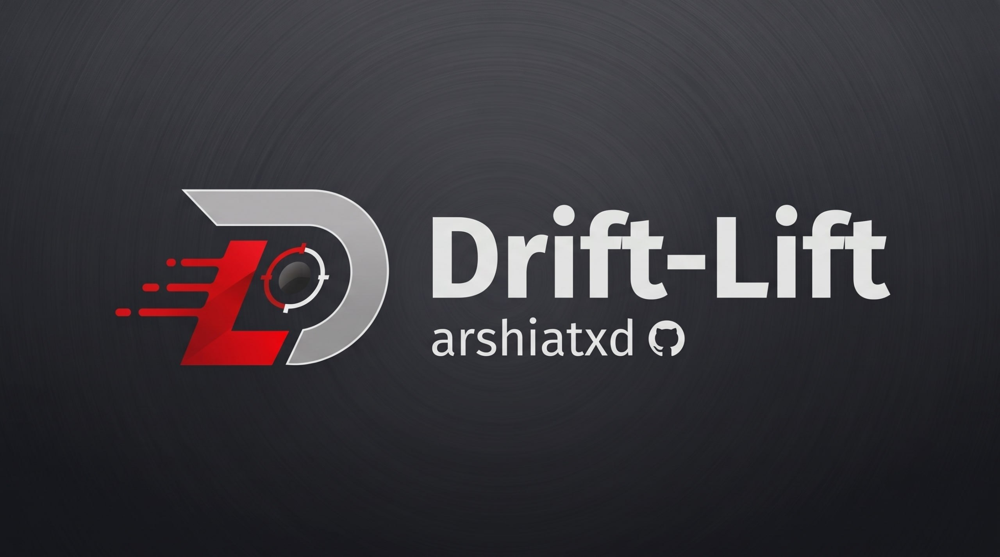

<div align="center">

# Drift Lift

**Gamepad controller calibration, stick drift correction, and remapping tool for Windows.**

<br/>



<br/>

[Features](#key-features) · [Installation](#installation) · [Supported Controllers](#supported-controllers) · [Microsoft Store](#microsoft-store-support) · [Changelog](CHANGELOG.md) · [License](#license)

</div>

---

## Overview

**Drift Lift** is an open-source Windows application designed to diagnose, calibrate, and eliminate analog stick drift on gamepads without forcing players to expand in-game deadzones. By combining 1000Hz low-latency polling, real-time center offset subtraction, and direct driver integration (ViGEmBus & HidHide), Drift Lift provides an esports-grade controller management experience.

---

## Key Features

- **Anti-Drift Calibration**: Measures resting analog jitter and dynamically shifts the center point to eliminate phantom movement.
- **Hardware-Accurate Visualizer**: Real-time visual feedback for stick deflection, trigger pulls, and button presses across Xbox 360, Xbox One/Series, DualShock 4, and DualSense controllers.
- **Full Button Remapping**: Rebind any digital button, D-Pad direction, bumper, or trigger with customizable click actions.
- **Dual-Controller Architecture**: Simultaneously connect multiple controllers with independent calibration profiles.
- **HidHide Integration**: Automatically hides the physical controller to prevent double-input conflicts in modern games and emulators.
- **PlayStation RGB Lightbar & Battery Telemetry**: Full control over LED brightness, color wheels, and real-time battery status reporting.
- **Vibration Motor Testing**: Test rumble motors with pulse, burst, heavy, and light vibration routines.
- **Modern AMOLED Theme**: Clean, responsive WPF interface designed for high legibility and minimal resource footprint.

---

## Supported Controllers

- **Xbox**: Xbox 360, Xbox One, Xbox One S/X, Xbox Series X/S, Xbox Elite Series 1 & 2
- **PlayStation**: DualShock 4 (PS4 V1 & V2), DualSense (PS5)
- **Generic XInput / DirectInput**: Compatible third-party USB and Bluetooth gamepads

---

## Installation

### Option 1 — Setup Installer (Recommended)
1. Download the latest **`DriftLift_Setup.exe`** from [Releases](https://github.com/arshiatxd/Drift-Lift/releases).
2. Run the installer and follow the guided wizard.
3. Launch Drift Lift from the Start Menu or Desktop shortcut.

### Option 2 — Build from Source
**Prerequisites:**
- Windows 10 (x64) or Windows 11
- [.NET 10 SDK](https://dotnet.microsoft.com/download/dotnet/10.0)
- [ViGEmBus Driver](https://github.com/nefarius/ViGEmBus/releases)

```bash
git clone https://github.com/arshiatxd/Drift-Lift.git
cd Drift-Lift
dotnet publish -c Release -o ./publish
```

---

## System Requirements

| Component | Minimum Specification |
| :--- | :--- |
| **Operating System** | Windows 10 64-bit (Version 1809 or higher) / Windows 11 |
| **Framework** | .NET 10.0 Desktop Runtime |
| **Drivers** | ViGEmBus (required for virtual gamepad passthrough) |
| **Optional Driver** | HidHide (recommended for double-input prevention) |

---


## Troubleshooting

- **Double Input in Games**: Enable HidHide from the settings tab to hide the physical controller while allowing the virtual controller through.
- **Logs & Crash Reports**: If an issue occurs, diagnostic logs are generated at:  
  `%LOCALAPPDATA%\DriftLift\crash.log`

---

## License

Distributed under the **MIT License**. See [LICENSE](LICENSE) for full details.
